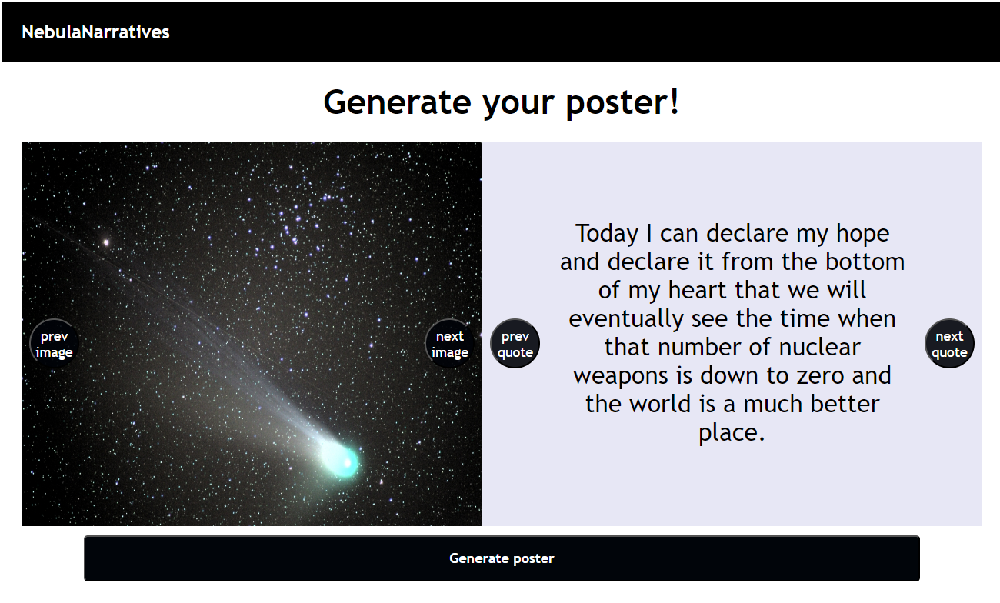

# Nebula Narratives

## Description

This website will help you generate a poster or image for inspiration. The first page will allow to to view random Nasa images and quotes by using the corresponding button. Once you select the image and quote you like, you can use the "Generate Poster" button to redirect you to a page that will create you poster. This is for entertainment purposes only, some quotes are pretty funky so it's ironic many times. 

This is really geared towards individual who love space and humor. 

## Usage

https://cdziedzic.github.io/Project-1/

## Credits

Christian Dziedzic - https://github.com/cdziedzic 
Jocelin Amaya - https://github.com/joceamayar
Cynthia Huertas - https://github.com/CyndiCodes

apis used:
Quote Garden: https://pprathameshmore.github.io/QuoteGarden/

Nasa: https://api.nasa.gov/.  https://api.nasa.gov/mars-photos/api/v1/rovers/curiosity/photos?sol=1000&page=2&api_key=DEMO_KEY

## Features

local Storage to render html to poster
3rd party apis for images and quotes
